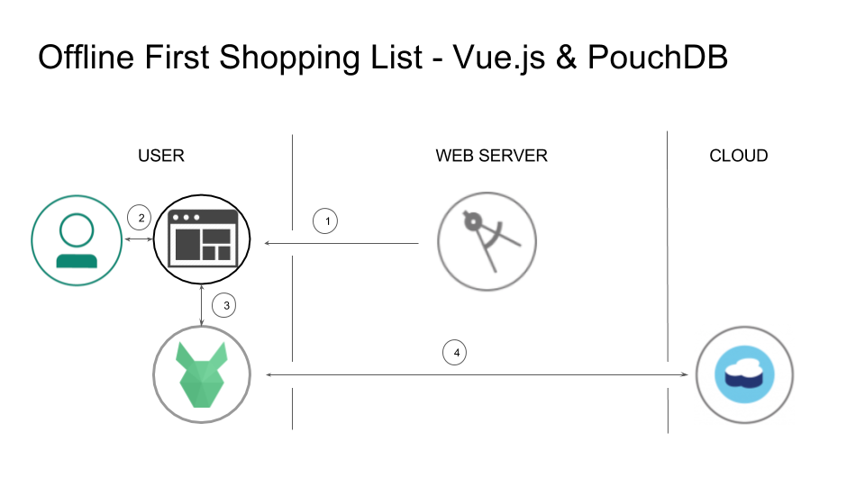

# Create an Offline First Shopping List with Vue.js and PouchDB

This code pattern is a reference implementation of an Offline First shopping list app, built as a [Progressive Web App](https://developers.google.com/web/progressive-web-apps/) using [Vue.js](https://vuejs.org/) and [PouchDB](https://pouchdb.com/). [This app is part of a series of Offline First demo apps, each built using a different stack.](https://github.com/ibm-watson-data-lab/shopping-list)

## Flow

1. Browser loads Progressive Web App's resources from the web server. 
2. User interacts with the web app to add shopping lists and list items. 
3. Data is stored locally in PouchDB.
4. PouchDB syncs its data with a remote database.

## Included components

* [Cloudant NoSQL DB](https://console.ng.bluemix.net/catalog/services/cloudant-nosql-db): A fully-managed data layer designed for modern web and mobile applications that leverages a flexible JSON schema. Based on the open source Apache CouchDB, IBM Cloudant provides additional full text and geospatial capabilities.

## Featured technologies

* [PouchDB](https://pouchdb.com/) - an in-browser database that can replicate to and from a remote Apache CouchDB or IBM Cloudant database.
* [Vue.js](https://vuejs.org/) - a progressive JavaScript framework.
* [Apache CouchDB](http://couchdb.apache.org/) - modern, document database hosted on your server or in the cloud.

## Key concepts

This shopping list app is a small single page web application consisting of an HTML file, a couple of CSS files, and a single JavaScript file, the Vue.js framework, and the PouchDB library. The web page will allow multiple shopping lists to be created (e.g., Groceries, Clothes, etc.) each with a number of shopping list items associated with them (e.g., Bread, Water, etc.).

So what sets this app apart? Its Offline First architecture. The Offline First approach plans for the most constrained network environment first, enabling a great user experience even while the device is offline or has only an intermittent connection, and providing progressive enhancement as network conditions improve. This design also makes the app incredibly performant (fast!) on the best of networks. 

PouchDB, CouchDB, and Service Worker are the primary tools that turn our simple shopping list app into a high performance, offline-capable Progressive Web App.

**Data stays safe on your device, even while it's offline.**
Persistence of shopping lists and item data entered by the user is achieved using the in-browser database PouchDB. This will allow your data to survive between sessions and when disconnected from the network. (Whether you remember that you need juice while you're on your trusty home Wi-Fi or in the middle of the wilderness, you can still add it your list.)

**Data syncs between devices when a connection is available.**
When a connection is available, the data is synced from the local device to a CouchDB database in the cloud, and can thus be shared across multiple devices or users. (Need to share your grocery list with your roommate or access it on both your phone and your laptop? No problem!)

**The app loads quickly, even while offline.**
To keep the app itself functional while offline, a [Service Worker](https://developer.mozilla.org/en-US/docs/Web/API/Service_Worker_API/Using_Service_Workers) is used to cache page resources (the most important HTML, CSS, and JavaScript files) when the web application is first visited. Each device must have a connection for this first visit, after which the app will be fully functional even while offline or in shoddy network conditions. (No more error messages or frustratingly slow page loads.)

**The app can be installed on a mobile device.**
In combination with the Service Worker used for caching, a [manifest file]((https://w3c.github.io/manifest/)) containing metadata allows the app to become a Progressive Web App, an enhanced website that can be installed on a mobile device and can then be used with or without an internet connection. (It's secretly still a website, but you can access it through one of those handy dandy little app icons on your homescreen!)

Explore the code in this GitHub repository to see how the Offline First design is applied.

# Live demo 

To see this app in action without installing anything, simply visit [https://ibm-watson-data-lab.github.io/shopping-list-vuejs-pouchdb](https://ibm-watson-data-lab.github.io/shopping-list-vuejs-pouchdb/) in a web browser or on your mobile device.

# Thanks to
[ibm-watson-data-lab](https://github.com/ibm-watson-data-lab/shopping-list-vuejs-pouchdb) for the original code.

# Links
* [More Shopping List Sample Apps](https://github.com/ibm-watson-data-lab/shopping-list)
* [Offline First](http://offlinefirst.org/)
* [Progressive Web Apps](https://developers.google.com/web/progressive-web-apps/)
* [Service Workers](https://developer.mozilla.org/en-US/docs/Web/API/Service_Worker_API/Using_Service_Workers)
* [Web App Manifest](https://w3c.github.io/manifest/)
* [PouchDB](https://pouchdb.com/)
* [Apache CouchDB](https://couchdb.apache.org/)
* [IBM Cloudant](https://www.ibm.com/cloud/cloudant)
* [Material Design Guidelines](https://material.io/guidelines/)
* [Vue Material](https://vuematerial.io/)
* [JavaScript](https://developer.mozilla.org/en-US/docs/Web/JavaScript)

# License
[Apache 2.0](LICENSE)
